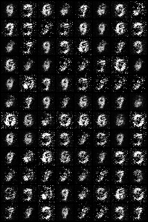
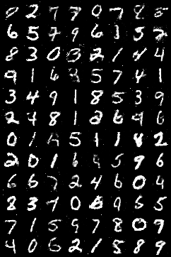
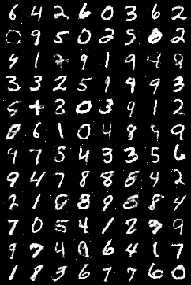
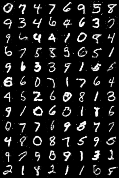
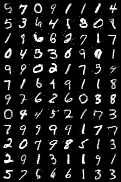
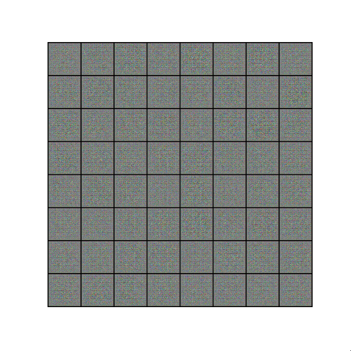
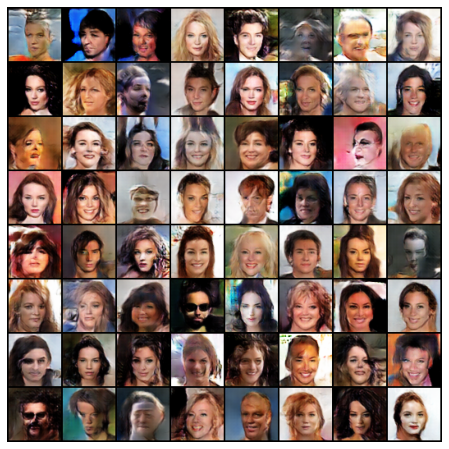

# GANs-pytorch
 Collection of GAN models and implementations

### Basic GAN
Basic GAN implementation using MNIST 
#### Summary
 Using a relatively simple GAN model.  
 
 MNIST data can be found [here](http://yann.lecun.com/exdb/mnist/) or in this case from [torchvision](https://pytorch.org/docs/stable/torchvision/index.html)
 #### Findings
 GAN model trained on 200 epochs.  
 
| 1 epoch     | 50 epochs | 100 epochs  |  150 epochs     |   200 epochs   |
| ------------|:---------:|:-----:|:-----:|:-----:|
|    |  |  |  |  |
 

### DCGAN
Deep-Convolutional GAN implementation using CelebA 
#### Summary
 Using a Deep-Convolutional GAN model.  
 
 CelebA data can be found [here](http://mmlab.ie.cuhk.edu.hk/projects/CelebA.html)
 #### Findings
 GAN model trained on 5 epochs.  
 
 
 
 Result after 5 epochs
 
 
